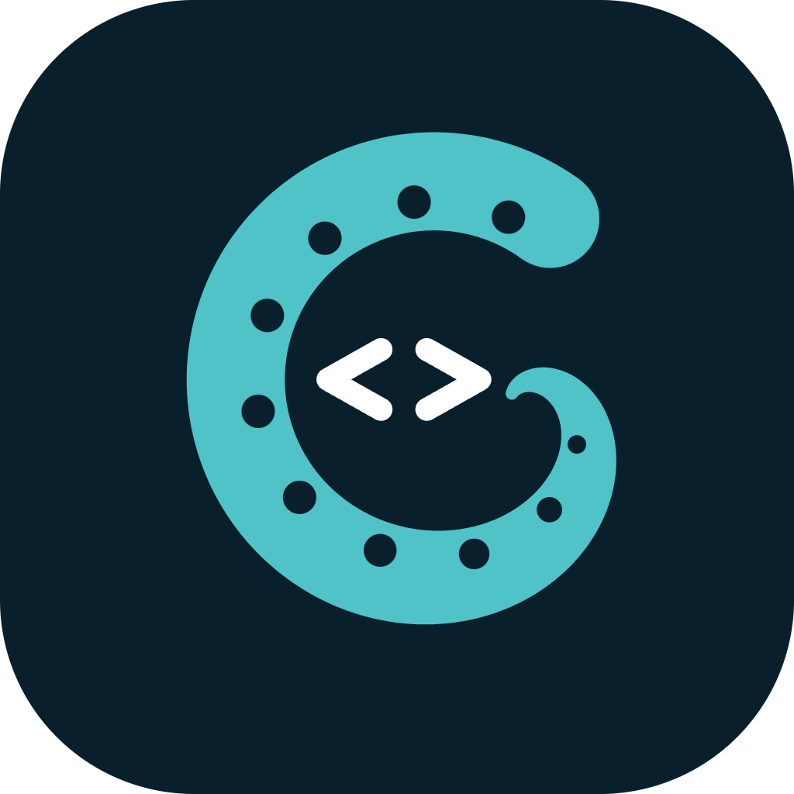

<p align="center">
  
</p>

# Craken

## 项目介绍

Craken 是一个面向编译原理与程序运行机制学习的 C 语言子集可视化工作台。它把代码编辑、编译过程观察、运行调试和数据结构视图整合在 JavaFX Local Visual Workbench 中，帮助学习者从源代码出发，逐步理解程序如何被分析、转换、生成和执行。

编译可视化流水线贯穿预处理、词法分析、语法分析、语义分析、IR lowering、汇编生成、Windows x64 指令编码、COFF 对象文件写入、PE32+ 链接和程序运行。各阶段通过结构化状态与单步控制连接源码、token、AST、作用域与符号、IR、汇编及最终可执行产物。

可视化 Debugger 以 IR Interpreter 为执行核心，在初始化时对 IR 插入源码行与函数调用 trap。调试上下文记录调用栈、栈内存、堆内存和输入输出，并支持在已有执行历史中正向或反向查看。JavaFX Workbench 直接使用编译会话和进程内调试 API 展示这些状态。

## OJ / STL 兼容补齐

标准头文件由 `lib/stl/*.mh` 实现；算法程序可以直接使用 `#include <vector>`、`#include <unordered_map>` 或 `#include <bits/stdc++.h>`，并通过 `main`、标准输入和标准输出运行。

| 本轮补齐项 | 支持范围 |
|---|---|
| 成员多声明器 | `struct E { int u, v, w; };`；同一声明中的指针、数组、默认成员初始化独立生效；模板实参逗号、括号内逗号和 lambda 默认值不会截断声明。 |
| 分配和所有权 | 单对象及动态数组 `new/delete/delete[]`、多维固定内层数组、值初始化、超对齐、空指针删除、数组逆序析构；全局分配／释放重载；`unique_ptr`、`shared_ptr`、`make_unique<T>`、`make_unique<T[]>`、`make_shared`、移动所有权、自定义删除器与共享别名指针。 |
| 七个头文件 | `<numeric>`、`<unordered_map>`、`<unordered_set>`、`<list>`、`<array>`、`<tuple>`、`<sstream>`，同时由 `<bits/stdc++.h>` 引入。 |
| `long double` | 独立的源语言类型与 `L` 字面量、重载／模板／算术类型规则、常量与全局初始化、变参、`cmath` 常用重载、流输入输出、原生和调试器的 `%Lf`。当前 Windows x64 后端使用 8 字节 binary64，精度与 `double` 相同。 |

哈希容器使用可扩容的桶和链式节点，支持自定义 hash/equal、查找、插入、删除、迭代、reserve/rehash、复制／移动，map 还支持 `try_emplace` 和 `insert_or_assign`；键不变时平均查找、插入和删除复杂度为 O(1)，最坏为 O(n)。扩容保留元素地址。`list` 使用双向链表，单节点插入、删除、splice 为 O(1)，稳定排序为 O(n log n)，并保留节点地址。

`numeric` 包含 accumulate、iota、inner_product、partial_sum、adjacent_difference、gcd、lcm 和无执行策略的 reduce；`array` 支持聚合初始化、零长度、迭代与结构化绑定；`tuple` 支持索引 get、make_tuple、tie、forward_as_tuple、比较与结构化绑定；字符串流支持数值／字符串输入输出、getline、格式控制、状态恢复和读写位置。

这里提供算法题常用接口，不宣称完整 ISO C++ 标准库覆盖。当前不包含异常展开、`nothrow`／类专用分配、`weak_ptr`／并发共享计数、自定义 allocator、unordered 多重容器／节点句柄、tuple_cat/apply、locale/streambuf。分配失败和越界检查沿用现有 `.mh` 库的终止策略。`long double` 不是 GCC x87 的 80 位扩展格式。

本轮功能补齐不代表 Hot100 全题覆盖、大数据复杂度对照或每项性能不超过系统 STL 1.2 倍的目标已经达成。

## 依赖版本

| 依赖 | 版本 |
|------|------|
| Java Toolchain | 21 |
| JavaFX | 21.0.2 |
| OpenJFX Gradle Plugin | 0.1.0 |
| RichTextFX | 0.11.7 |
| JUnit Jupiter / Platform Console | 5.11.4 / 1.11.4 |
| Gradle Wrapper | 8.7 |
| Graphviz（Windows x64 完整运行时） | 16.1.0 |

## 内置终端

底部面板使用 JediTerm 3.76 和 pty4j 0.13.12，通过 Windows ConPTY 运行 PowerShell。
直接在终端正文输入，Enter 执行；Tab 补全、方向键、Ctrl+C、交互式程序和 ANSI 颜色由终端与 PowerShell 处理。
复制和粘贴使用 Ctrl+Shift+C / Ctrl+Shift+V。

通过 `craken.bat` 启动时，终端的初始目录为项目根目录；也可用 `craken.project.root` 系统属性指定。
右侧列表的 `+` 可创建独立会话，切换面板会保留进程和输出；关闭面板或应用会清理对应进程。
JediTerm 依赖从 JetBrains 官方缓存仓库解析，其余依赖使用 Maven Central。

## 运行当前代码

右侧活动栏的运行图标会先收起信息栏，再编译点击时选中标签的当前编辑内容（包含未保存的修改，不自动保存）。
编译在后台通过 `CompilerApi` 执行，关闭逐步结果记录，到链接完成后取得可执行产物；编译失败只显示诊断，不启动旧产物。
编译期间保留 IO 顶部标题栏，进度条只填充其下方的内容区，通过 `CompilerApi.nextStage` 逐阶段执行，每完成一个阶段前进一步；链接完成后立即切换到程序输入输出，取消入口保留，失败时显示详细诊断。
每次产物保存在项目根目录的 `build/craken-runs/run-*` 独立目录中，并在源文件所在目录启动独立的“输入输出”项，直接连接用户程序而不是 PowerShell。
底部右侧列表的输入输出项默认命名为 `IO 1`、`IO 2`……；运行按钮与公开创建接口共用独立于 PowerShell 的递增编号，关闭项后不重排或复用编号，面板内部仍显示具体程序名。
程序支持标准输入和 Ctrl+C；结束后保留输出并显示退出码，此时按一次回车关闭该项。运行中的回车仍正常传给程序，不会误关面板；重新点击右侧运行图标会重新编译当前内容。
编译中可取消，关闭运行面板会取消编译或结束该面板自己的进程，不影响其他终端。

其他调用者可通过 `InteractionArea.newInputOutput(workingDirectory, executable)` 创建有类型的 `InteractionItem<InputOutputPanel>`，也可使用带 `title` 的重载自定义标题。
`InputOutputPanel` 本身也是公开组件，提供 `start()`、`activate()`、`stop()`、`close()`、`isFinished()`、`exitCode()` 和 `setOnCloseRequest(...)`；独立使用时由宿主处理关闭请求。

## 编译 Pipeline 展示台

右侧活动栏的第二个图标打开编译展示台，并将右侧区域完全展开。“输入”和“输出”两个可视化容器展示每步冻结的源码、Token、AST、语义注解、IR、汇编、COFF 和 PE 内容；默认左右均分，中间分隔线可拖动。右侧信息栏宽 356px，顶部为“下一步”和“下一阶段”。下方采用纵向轨道列表，八个阶段各有独立图标与说明，阶段之间以连续细线相连，并均分可用高度；矮窗口下保持可读行高并允许滚动。选中背景沿用交互面板样式，已完成阶段及其连接线显示绿色，当前阶段以蓝色图标标识。

编译使用点击图标时当前标签的编辑内容（包括未保存修改），在后台按实际编译器步骤推进。“下一步”执行一步，“下一阶段”完成当前阶段；已完成阶段可以点击回看，未来阶段不可选，回看不会倒退编译进度。完成链接后停止，编译错误显示在信息栏中。再次打开相同源码保留进度，源码或文件变化后开始新会话；独立产物保存在 `build/craken-pipelines/pipeline-*` 中。

再次点击已选中的 Pipeline 图标会取消选中并完全收起信息栏；重新打开相同源码时保留编译进度、阶段选择和输入输出分栏比例。

每一步先生成完整双侧快照，再在同一 FX 调用中切换画面；异步布局结果带版本校验。展示投影失败时保留上一完整帧，下一次操作重试已捕获的投影，不增加编译步数。阶段回看使用冻结历史，不读取已经变化的 AST 位置。源码切换会取消旧请求并释放旧容器，迟到结果不会覆盖新会话。

## 可视化容器 API

核心入口为 `craken.visualization.api.VisualizationSession`，默认实现为 `DefaultVisualizationSession`；FX 宿主为 `UiVisualizationContainer`。核心模型和布局协议不依赖 JavaFX，也不识别编译器或 VM 对象。页必须在初始化时注册 `PageType`；页内节点 ID 单调递增，页 ID 在容器内唯一。节点归属禁止成环，页可在选中节点路径中重复出现，每次出现使用独立控件和高亮。

下例在 FX 线程创建单例及红黑树页。所用类型来自 `craken.visualization.api`、`model`、`type` 和 `craken.ui.component.visualization`；`TopologyEdge` 位于 `model.relation`。

```java
var view = new UiVisualizationContainer();
var session = view.session();
var rootPage = session.initializeRoot(BuiltinPageTypes.point());
var owner = session.reserveNodeId(rootPage);
session.addNode(new OperationPath(null, owner), ViewNode.Spec.point("singleton"));
var treePage = session.initializePage(BuiltinPageTypes.tree(true), owner);
var root = session.reserveNodeId(treePage);
session.addNode(new OperationPath(owner, root), new ViewNode.Spec(ViewNode.Kind.TREE, "root"));
var child = session.reserveNodeId(treePage);
session.addNode(new OperationPath(owner, child), new ViewNode.Spec(ViewNode.Kind.TREE, "child"));
session.modify(MutationBatch.of(new VisualizationCommand.Connect(
        new OperationPath(owner, root), new OperationPath(owner, child),
        TopologyEdge.Direction.FORWARD))).requireSuccess();
view.refresh();
// 宿主销毁时在 FX 线程调用 view.close()。
```

空页首次分配直接展示，后续节点按页类型进入 READY；连接后提升到连通 part，断链重分 part。READY 当前显示待连接数量，可滚动列表按计划留待后续实现。`Compose` 描述同页包含，`Connect` 描述绘制连线，`AttachOwnership` 描述跨页归属，三者不能混用。`PageBindingRule.Spec.page(parentPage)` 注册动态大页绑定，包含 READY 节点。`Configure(new VisualizationOptions(false, true))` 关闭自动导航并保留向上高亮；第二个参数控制高亮传播。

`showSnapshot(snapshot)` 只显示纯值历史，不恢复外部活动会话。`refresh()` 返回活动模型，`setZoom(...)` 缩放，`layoutPendingProperty()` 和 `diagnostics()` 可用于宿主状态显示。无参宿主拥有其会话；传入会话的宿主借用它，调用者负责关闭会话。布局采用两条后台工作线程与有界缓存；仅高亮变化复用几何。共享 AST 等非树宏拓扑使用正式 Graphviz，运行时缺失时显示布局错误。

顶部“页面路径”可选择因窗口宽度而隐藏的上游节点；每个出现位置按页和节点身份保存缩放、滚动状态，返回时恢复。Ctrl+滚轮只缩放当前出现位置，历史路径选择也只影响历史显示。

`SetPageLayout(page, new PageLayoutHints(root, order))` 设置显示根及部分节点顺序，适用于树旋转后的展示；不解释业务指针字段，也不改变焦点。提示随快照保存，节点释放时自动裁剪。`Connect` 的扩展构造器接收两个端口名和 `EdgeStyle`，支持 `node`、四个边界方向及 `field:<字段名>`；同一对节点可保留不同端口的连线，`Disconnect` 使用对应端口精确删除。`Touch` 的结果位于 `MutationResult.reads()`，保留每条命令当时的内容，失败批次不返回局部读取结果。

## Debugger 结构适配

使用 `new Debugger(source, "", collector)` 开启会话专属 `RuntimeEventCollector`，默认 Debugger 路径关闭事件收集。`DebugVisualizationAdapter` 读取止点的不可变内存和事件，调用者注册 `DebugStructureDescriptor`（字段类型/偏移、拓扑或归属引用、数组长度/步长、realloc 策略）和 `RootAddress`。不根据 malloc 大小猜测结构；自动识别器是后续能力。

`DebugStructureRecognizer` 提供只读候选识别接口；调用者决定是否采用返回的描述并显式注册，适配器不会自动运行它。

TOPOLOGY 引用默认从自己的 `field:<字段名>` 连到目标节点；`Reference` 扩展构造器可指定两端端口。不同字段即使指向同一节点，也保留独立连线；同一具体端口对的互反方向合为双向箭头。引用字段会显示在卡片中，数组元素描述尺寸必须适合声明的步长。

```java
var types = new PageTypeRegistry();
types.register(BuiltinPageTypes.point());
var adapter = new DebugVisualizationAdapter(new DefaultVisualizationSession(), types);
adapter.registerDescriptor(new DebugStructureDescriptor(
        "value", "point", DebugStructureDescriptor.ViewKind.POINT, 4,
        List.of(new DebugStructureDescriptor.Field("value", 0, DebugMemoryReader.ScalarType.SIGNED32)),
        List.of(), null, DebugStructureDescriptor.ReallocationPolicy.RECREATE));
adapter.registerRoot(new DebugStructureDescriptor.RootAddress("value", knownVmAddress));
var history = new DebugVisualizationHistory(adapter, collector, releaseDisplay);
var frame = history.show(debugApi.current());
// 在 FX 线程：view.showSnapshot(history.displayedSnapshot());
// 下一止点：history.show(debugApi.next()); 回退：history.show(debugApi.previous());
```

示例的 `knownVmAddress` 必须是调用者已知的有效 4 字节整数地址，不能使用 Java 对象地址。未连接分配通过 `registerObject(descriptorKey, address, page, pre)` 手动登记后进入相应页；`Address` 由 `DebugMemoryReader(context.runtime()).resolve(...)` 得到，包含分配代次以隔离地址重用。完整可运行结构示例见 `DebugVisualizationEndToEndTest`。

`history.show(index)` 只切换展示，`DebugApi.previous()/next()` 才移动调试光标。已知 Context 不重复消费事件。`Frame.snapshot()` 保留历史来源版本，`displayedSnapshot()` 携带当前递增 epoch；后者用于布局失效控制。程序完成后可继续回看，显式 `history.close()` 才释放历史、映射、显示资源与 collector。Adapter 两参构造拥有 session，三参 `ownsSession=false` 借用 session。`releaseDisplay` 应在正确的 FX 线程释放宿主；即使它抛错，其他资源仍会清理。只有 collector 的 `close()` 支持从显示线程调用，其余事件操作由 VM 线程独占。

## 可视化构建与验收

在项目根目录使用 JDK 21。开发运行与发布包使用同一份锁定的完整 Graphviz 分发；`.local` 不纳入 Git。首次准备可按锁定清单下载并校验：

```powershell
$runtimeLock = Get-Content config/visualization/graphviz-runtime.json -Raw | ConvertFrom-Json
$archiveDir = Split-Path $runtimeLock.archivePath -Parent
New-Item -ItemType Directory -Path $archiveDir -Force | Out-Null
Invoke-WebRequest -Uri $runtimeLock.archiveUrl -OutFile $runtimeLock.archivePath
if ((Get-FileHash $runtimeLock.archivePath -Algorithm SHA256).Hash -ne $runtimeLock.archiveSha256) {
    throw 'Graphviz archive checksum mismatch'
}
Expand-Archive -LiteralPath $runtimeLock.archivePath -DestinationPath $archiveDir -Force
./scripts/verify-visualization.ps1 -Stage C25
```

每次提交前使用该验收入口，重新编译并检查模型、布局、适配、真实 FX、原 UI 回归和默认回归的本次 XML；必需测试缺失、跳过或失败均拒绝验收。门禁会生成 `build/install/Craken`，从任意 cwd 用安装包 JAR 定位并执行自带 neato，完整核验 303 个官方运行文件、校验和及许可证；不依赖全局 Graphviz。`installDist`、`distZip`、`distTar` 都包含 `runtime/graphviz`。

详细模型与职责见[技术方案](可视化容器技术方案.md)，逐提交证据见[实施记录](可视化容器实施记录.md)，测量方法与开销见[性能基准](可视化性能基准.md)。

## 通用弹窗

`craken.ui.component.feedback.UiModalDialog<R>` 统一提供浅色外观、标题栏拖动、模态归属和键盘行为，支持任意 JavaFX `Node` 内容及业务类型的操作结果。在 JavaFX 线程创建和显示；有 owner 时只阻塞所属窗口，无 owner 时使用应用模态。

文字提示使用 `UiMessageDialog.notice(...)`、`confirm(...)` 或 `saveChanges(...)`。三个入口均接收 owner、标题、正文和可选详情（无详情可传 `null`），返回可调用 `show()` / `showAndWait()` 的弹窗；保存确认返回 `SAVE`、`DISCARD` 或 `CANCEL`，普通确认返回 `CONFIRMED` 或 `CANCEL`。

```java
var result = UiMessageDialog.confirm(owner, "确认操作", "是否继续？", null)
        .showAndWait().orElse(UiMessageDialog.Result.CANCEL);
if (result == UiMessageDialog.Result.CONFIRMED) {
    performAction();
}
```

自定义表单直接使用通用容器，操作结果可以是 enum、record 或其他业务类型：

```java
enum Choice { APPLY, CANCEL }
var apply = UiModalDialog.Action.primary("应用", Choice.APPLY);
var cancel = UiModalDialog.Action.cancel("取消", Choice.CANCEL);
var dialog = new UiModalDialog<>(owner, "设置", formContent, List.of(apply, cancel));
dialog.actionButton(apply).disableProperty().bind(formInvalid);
Choice choice = dialog.showAndWait().orElse(Choice.CANCEL);
```

多按钮弹窗必须包含一个取消操作，最多一个主操作；X 和 Esc 返回取消结果，Enter 执行默认主操作。单按钮提示的 X / Esc 返回其唯一结果。组件只返回用户选择，保存、删除等业务动作由调用方执行。按钮可通过 `actionButton(...)` 禁用或安装事件过滤器校验，尺寸可通过 `getDialogPane()` 调整。`UiDialog` 仍是供 `UiOverlay` 使用的内部布局容器，不承担模态窗口生命周期。
